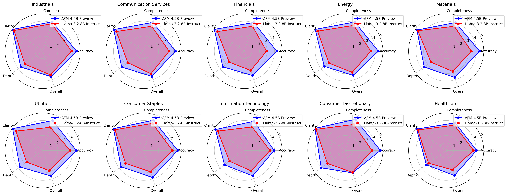

# Radar Evaluator

[](https://github.com/juliensimon/radar-evaluator/actions/workflows/ci.yml)
[](htmlcov/index.html)
[](https://github.com/juliensimon/radar-evaluator/actions)
[](https://creativecommons.org/licenses/by/4.0/)
[](https://github.com/pre-commit/pre-commit)
[](https://github.com/psf/black)
[](https://flake8.pycqa.org/)
[](https://bandit.readthedocs.io/)
[](https://mypy.readthedocs.io/)
[](https://github.com/juliensimon/radar-evaluator)
[](https://github.com/juliensimon/radar-evaluator/graphs/commit-activity)
[](https://github.com/juliensimon/radar-evaluator/pulls)
[](https://en.wikipedia.org/wiki/Command-line_interface)
[]()
[]()
[]()

---

A professional, extensible framework for evaluating and comparing Large Language Models (LLMs) across different industry domains using automated scoring, radar charts, and comprehensive reporting.



*Example radar chart comparing AFM-4-5-B-Preview vs Llama-3-2-8-B-Instruct-Turbo models across multiple evaluation metrics*

## 🎯 What is Radar Evaluator?

Radar Evaluator is a sophisticated tool designed to systematically assess and compare the performance of different LLMs across various industry-specific domains. It uses a multi-stage evaluation process that combines automated question generation, model response evaluation, and comprehensive visualization to provide insights into model capabilities.

### Key Features

- **Multi-Model Comparison**: Evaluate and compare multiple LLMs side-by-side
- **Industry-Specific Evaluation**: Domain-specific questions across 10+ industries
- **Automated Scoring**: AI-powered evaluation using **DeepSeek-R1 as the judge**
- **Radar Chart Visualization**: Intuitive radar charts for easy comparison
- **Comprehensive Reporting**: Detailed Markdown reports with scores and analysis
- **Extensible Architecture**: Easy to add new models, industries, and metrics
- **CLI Interface**: Simple command-line interface for automation
- **Parallel Processing**: Efficient evaluation using multi-threading

## 🏗️ How It Works

### 1. **Question Selection & Generation**
The tool selects industry-specific questions from a curated database covering:
- **Information Technology**: AI/ML, cybersecurity, cloud architecture
- **Healthcare**: Medical research, drug discovery, patient care
- **Financial Services**: Risk management, trading, regulatory compliance
- **Consumer Discretionary**: Retail, e-commerce, customer experience
- **Communication Services**: Media, telecommunications, content creation
- **Industrials**: Manufacturing, supply chain, automation
- **Consumer Staples**: Food & beverage, agriculture, sustainability
- **Energy**: Renewable energy, grid management, sustainability
- **Utilities**: Infrastructure, smart cities, resource management
- **Materials**: Advanced materials, manufacturing processes

### 2. **Model Response Generation**
For each selected question:
- Generates a system prompt tailored to each model
- Sends the question to both models being compared
- Collects streaming responses for real-time feedback
- Handles errors gracefully with fallback mechanisms

### 3. **AI-Powered Evaluation**
Each model response is evaluated by **DeepSeek-R1** (the judge) across five key metrics:

| Metric | Description | Scale |
|--------|-------------|-------|
| **Accuracy** | Factual correctness and reliability of information | 1-5 |
| **Completeness** | How thoroughly the response addresses all aspects | 1-5 |
| **Clarity** | Organization and understandability of the explanation | 1-5 |
| **Depth** | Level of detail and insight provided | 1-5 |
| **Overall Quality** | Comprehensive assessment of response quality | 1-5 |

### 4. **Score Processing & Validation**
- Extracts numerical scores using regex patterns
- Validates scores against defined ranges (1-5 scale)
- Applies fallback logic for missing or invalid scores
- Ensures data quality and consistency

### 5. **Visualization & Reporting**
- **Radar Charts**: Multi-dimensional comparison visualization
- **Summary Reports**: Markdown reports with detailed analysis
- **Statistical Analysis**: Average scores, standard deviations
- **Export Options**: PNG, Markdown, JSON, and CSV formats

## 🚀 Quick Start

### Prerequisites

1. **Python 3.8+** installed on your system
2. **Together AI API Key** for model access
3. **Git** for cloning the repository

### Installation

```bash
# Clone the repository
git clone https://github.com/juliensimon/radar-evaluator.git
cd radar-evaluator

# Create and activate virtual environment (recommended)
python3 -m venv .venv
source .venv/bin/activate  # On Windows: .venv\Scripts\activate

# Install the package
pip install .
```

### Configuration

1. **Set your API key**:
```bash
export TOGETHER_API_KEY="your_api_key_here"
```

2. **Customize models** (optional):
Edit `config.json` to add or modify models:
```json
{
  "models": {
    "your_model": {
      "name": "Your Model Name",
      "model_endpoint": "your/model/endpoint",
      "model_key": "your_model"
    }
  }
}
```

### Basic Usage

```bash
# Compare two models across all industries
python radar_evaluator.py --model1 afm --model2 llama3_8b

# Compare with specific industries
python radar_evaluator.py --model1 afm --model2 gemma --industries "Information Technology,Healthcare"

# Limit the number of questions per industry
python radar_evaluator.py --model1 afm --model2 qwen --num-questions 5
```

### Advanced Usage

```bash
# Full help and options
python radar_evaluator.py --help

# Available models
python radar_evaluator.py --list-models

# Custom configuration file
python radar_evaluator.py --config custom_config.json --model1 afm --model2 gemma
```

## 📊 Understanding the Results

### Output Structure

```
radar_results/
└── 20241216_143022/           # Timestamp-based results directory
    ├── radar_chart.png        # Radar chart visualization
    ├── summary_report.md      # Detailed Markdown report
    ├── results.json          # Raw evaluation data
    └── scores.csv            # Processed scores for analysis
```

### Interpreting Radar Charts

- **Spider/Radar Chart**: Each axis represents an evaluation metric
- **Model Comparison**: Different colors/lines for each model
- **Score Scale**: 1-5 scale where 5 is the best performance
- **Area Coverage**: Larger area indicates better overall performance

### Reading the Summary Report

The Markdown report includes:
- **Executive Summary**: High-level comparison and key findings
- **Detailed Scores**: Per-question breakdown with scores
- **Statistical Analysis**: Averages, standard deviations, confidence intervals
- **Industry Breakdown**: Performance by industry domain
- **Recommendations**: Insights and suggestions based on results

## ⚙️ Configuration

### Model Configuration (`config.json`)

```json
{
  "models": {
    "model_key": {
      "name": "Display Name",
      "model_endpoint": "provider/model-name",
      "model_key": "internal_key"
    }
  },
  "evaluation": {
    "evaluator_model": "deepseek-ai/DeepSeek-R1",  # The judge model
    "max_tokens": 1024,
    "temperature": 0.7,
    "evaluation_max_tokens": 2048,
    "evaluation_temperature": 0.3
  },
  "metrics": {
    "accuracy": {"min": 1, "max": 5},
    "completeness": {"min": 1, "max": 5},
    "clarity": {"min": 1, "max": 5},
    "depth": {"min": 1, "max": 5},
    "overall": {"min": 1, "max": 5}
  }
}
```

### Industry Questions (`industry_questions.json`)

Add custom questions for specific industries:

```json
{
  "Your Industry": [
    "Your domain-specific question here?",
    "Another industry-relevant question?"
  ]
}
```

## 🔧 Customization

### Adding New Models

1. Add model configuration to `config.json`
2. Ensure the model endpoint is accessible via Together AI
3. Test with a small evaluation first

### Adding New Industries

1. Add industry questions to `industry_questions.json`
2. Follow the existing format with domain-specific questions
3. Ensure questions are complex enough for meaningful evaluation

### Customizing Metrics

1. Modify the metrics section in `config.json`
2. Update the evaluation prompt in the code
3. Adjust score extraction patterns if needed

## 🧪 Testing & Development

### Running Tests

```bash
# Run all tests
python -m pytest

# Run with coverage
python -m pytest --cov=radar_evaluator

# View coverage report
open htmlcov/index.html
```

### Code Quality

```bash
# Format code
black .

# Lint code
flake8 .

# Type checking
mypy .

# Security scanning
bandit -r .
```

## 📈 Performance Considerations

- **Parallel Processing**: Uses ThreadPoolExecutor for concurrent evaluations
- **Streaming Responses**: Real-time response collection for better UX
- **Error Handling**: Robust error handling with fallback mechanisms
- **Memory Management**: Efficient data structures and cleanup
- **API Rate Limiting**: Built-in handling for API limits

## 🤝 Contributing

We welcome contributions! Please see our contributing guidelines:

1. **Fork** the repository
2. **Create** a feature branch
3. **Make** your changes
4. **Test** thoroughly
5. **Submit** a pull request

### Development Setup

```bash
# Install development dependencies
pip install -e ".[dev]"

# Set up pre-commit hooks
pre-commit install
```

## 📄 License

This project is licensed under the [Creative Commons Attribution 4.0 International License](https://creativecommons.org/licenses/by/4.0/).

## 🙏 Acknowledgements

- **Together AI** for providing the model inference platform
- **DeepSeek AI** for providing the judge model (DeepSeek-R1)
- **Matplotlib** for radar chart visualization
- **Pandas** for data processing and analysis
- **Pytest** for comprehensive testing framework

## 📞 Support

- **Issues**: [GitHub Issues](https://github.com/juliensimon/radar-evaluator/issues)
- **Discussions**: [GitHub Discussions](https://github.com/juliensimon/radar-evaluator/discussions)
- **Documentation**: This README and inline code comments

---

**Built with ❤️ for the AI community**
